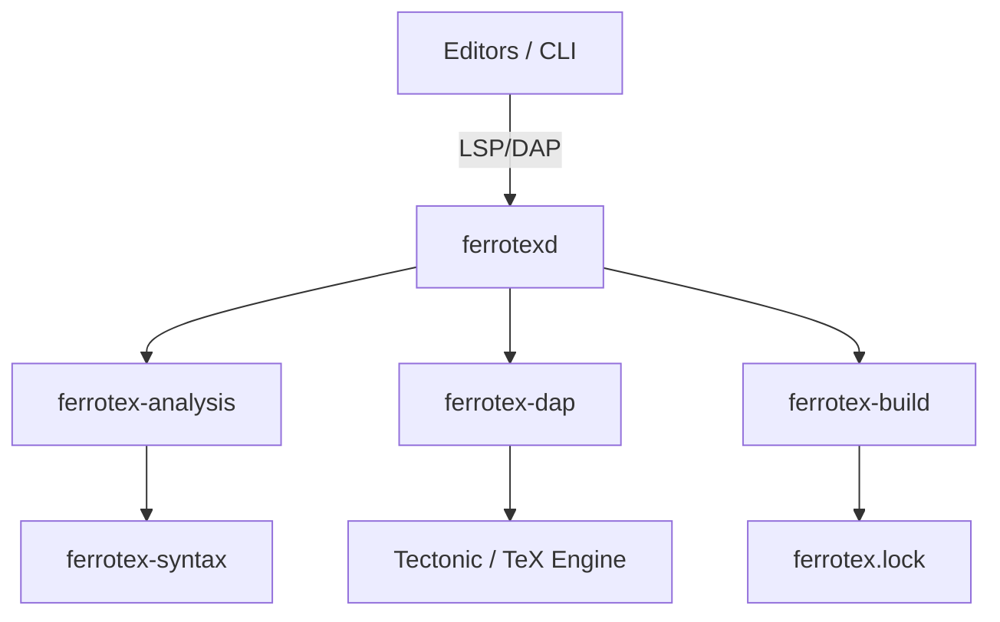

# FerroTeX: The Scientific LaTeX Compiler Platform

[](https://github.com/jxoesneon/FerroTeX/actions/workflows/ci.yml)
[](https://open-vsx.org/extension/ferrotex/ferrotex)
[](LICENSE)
[](https://www.rust-lang.org/)

**FerroTeX** is a high-fidelity, research-grade LaTeX language platform designed for precision, reproducibility, and deep observability. Built entirely in **Rust** 🦀, it provides a modular ecosystem for modern scientific typesetting.

---

## 🏗️ Architecture & Ecosystem

FerroTeX is designed as a modular set of components rather than a monolithic extension.



### Core Crates

- **`ferrotex-syntax`**: Lossless, fault-tolerant parser using `rowan`. Preserves 100% of source fidelity including trivia.
- **`ferrotex-analysis`**: Semantic engine for LaTeX. Implements context-aware completion and jaggy matrix detection.
- **`ferrotex-build`**: DAG-based build graph with content-addressable reproducibility (SHA256).
- **`ferrotex-dap`**: Debug Adapter Protocol implementation for stepping through TeX passes and register inspection.

---

## 💎 Technical Pillars

### 1. Scientific Reproducibility

FerroTeX introduces the concept of a **Hermetic Build** to the TeX world.

- **`ferrotex.lock`**: Captures SHA256 hashes of all inputs, including system packages and local includes.
- **Content-Addressing**: Ensures that your paper builds identically across machines and time.

### 2. Deep Semantic Intelligence

Unlike traditional matchers, FerroTeX performs structural analysis of the Document Object Model (DOM).

- **Matrix Dimension Tracking**: Detects mismatched ampersands `&` in complex environments like `matrix` or `aligned`, even when using `\multicolumn`.
- **Macro Expansion Analysis**: Uses abstract interpretation to prevent recursion loops and verify macro safety.
- **Deprecated-Command Diagnostics**: Real-time `warning` diagnostics for LaTeX 2.09 font commands (`\bf`, `\it`, `\rm`, etc.), `$$...$$` display math, and obsolete packages (`times`, `a4wide`). Each diagnostic carries a one-click **quick-fix** code action.
- **BibLaTeX Support**: `\addbibresource` is indexed identically to `\bibliography`; `\RequirePackage` is scanned alongside `\usepackage`.

### 3. Professional Observability (DAP)

Debug your TeX source like code. The integrated **Debug Adapter Protocol** (DAP) shim allows:

- **Pass-Level Stepping**: Pause on macro expansion or file inclusion.
- **Register Shadowing**: Real-time inspection of `\count`, `\dimen`, and `\skip` registers.

---

## 🚀 Status: v0.24.0 (The "Diagnostic Completeness" Update)

FerroTeX v0.24.0 closes the gap between the static analysis already present in the workspace index and what is surfaced through LSP. Deprecated LaTeX 2.09 font commands, obsolete `$$` display math, and obsolete packages now produce live `warning` diagnostics with quick-fix code actions — no rebuild required.

### Performance (M1 Max / Linux x64)

- **Syntax Indexing**: ~1.8ms per 10k LOC.
- **LSP Startup**: <45ms.
- **Log Streaming**: Zero-allocation parsing at >60 MB/s.

### Platform Support

| Platform                  | Binary Bundled | Support Status   |
| :------------------------ | :------------: | :--------------- |
| **Linux (x64)**           |       ✅       | Production Ready |
| **macOS (Silicon/Intel)** |       ✅       | Production Ready |
| **Windows (x64)**         |       ✅       | Production Ready |

---

## 🛠️ Developer Setup

Requires **Rust 1.85+**.

```bash
# Clone and build
git clone https://github.com/jxoesneon/FerroTeX
cd FerroTeX
cargo build --release

# Run CLI parse on a log file
./target/release/ferrotex parse main.log
```

## 🤝 Contributing & Community

We are building a robust toolchain for the future of scientific publishing.

- **Community & Support**: [GitHub Issues](https://github.com/jxoesneon/FerroTeX/issues)
- **Roadmap**: See [ROADMAP.md](ROADMAP.md)

## 📄 License

Licensed under the **Apache License, Version 2.0**. See [LICENSE](LICENSE) for details.

---

_Built with ❤️ by the FerroTeX Contributors._
