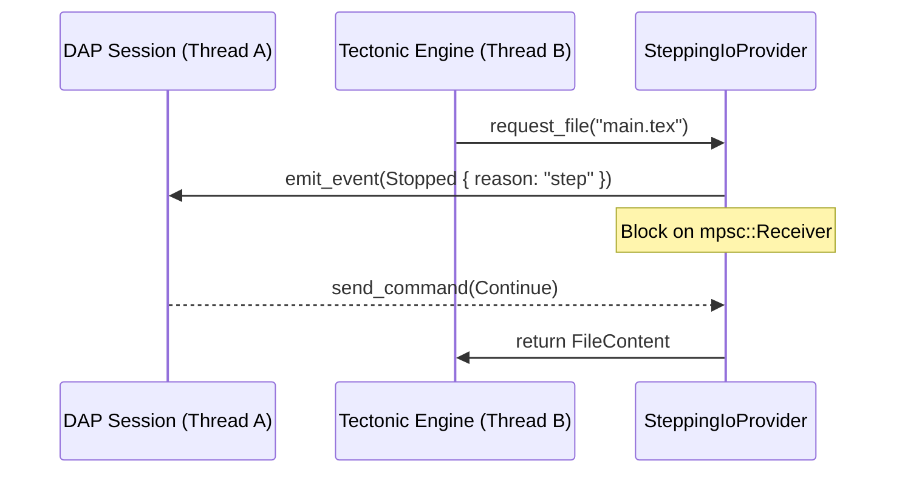

# Architecture Deep-Dive: Tectonic I/O Interception

This document explains the technical strategy used by FerroTeX to implement a **Debug Adapter Protocol (DAP)** interface for the Tectonic engine.

## 🔴 The Challenge: Non-Interruptible Engines

Traditional TeX engines (and their modern wrappers like Tectonic) are designed as "batch processors." Once compilation starts, the engine runs to completion (or failure) without providing hooks for an external debugger to pause or inspect state _during_ a pass.

To implement **Stepping** and **Register Inspection**, we need a way to:

1. Halt the engine safely.
2. Signal a pause to the IDE.
3. Resume on user command.

## 🛠️ The Solution: `SteppingIoProvider`

Instead of modifying the C/C++ XeTeX core, FerroTeX leverages Tectonic's Rust-based `IoProvider` trait.

### The Interception Flow

Every file request, font load, or buffer write in Tectonic must go through an `IoProvider`. We implement a wrapper that intercepts these calls:

### Key Components

1.  **Blocker Logic**: When the engine requests I/O, we check the current "Stepping Mode". If enabled, we perform a blocking receive on a synchronization channel.
2.  **State Shadowing**: While the engine is blocked, we can safely read the `tectonic_xetex_layout` structures to extract macro definitions and register values with zero risk of race conditions.
3.  **On-the-fly Hashing**: As a side effect of interception, we calculate SHA256 hashes for every file read, providing the data needed for `ferrotex.lock` reproducibility without an extra I/O pass.

## 💎 Benefits

- **Zero Engine Modification**: Works with standard Tectonic builds.
- **Precision**: We can pause at the exact moment a specific file is included or a specific package is loaded.
- **Reliability**: By blocking at the I/O layer, we ensure the engine is in a stable, consistent state for inspection.

---

_Part of the FerroTeX Internal Research Documentation._
